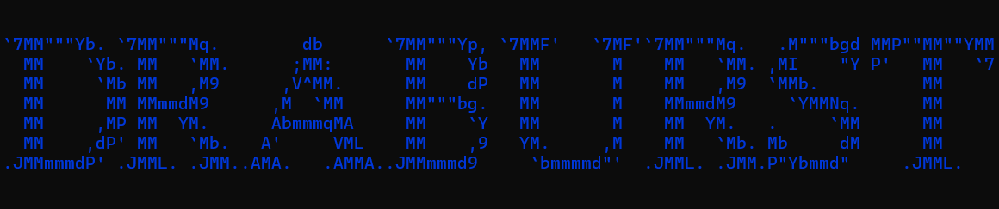

# Login-Signup-system

## Table of Contents
- [Login-Signup-system](#login-signup-system)
  - [Table of Contents](#table-of-contents)
  - [About](#about)
  - [Features](#features)
  - [Installation](#installation)
- [Example of setting up a virtual environment](#example-of-setting-up-a-virtual-environment)
- [Install dependencies](#install-dependencies)
    - [Clone](#clone)
    - [Prerequisites](#prerequisites)

## About
a program for understanding how registration and login work, for beginners in it.
and you can also create money transactions

## Features
- Feature 1: you can use it wherever you want.
- Feature 2: everything is very easy to understand.
- Feature 3: will help beginners understand how registration and login work.

## Installation
Instructions on how to install and set up the project.


# Example of setting up a virtual environment
python -m venv venv
source venv/bin/activate # On Windows, use `venv\Scripts\activate`

# Install dependencies
pip install -r requirements.txt


### Clone
Clone the repository to your local machine using:
```sh
git clone https://github.com/Draburst/Login-Signup-system.git
```

### Prerequisites
```sh
git clone https://github.com/Draburst/Login-Signup-system.git

cd Login-Signup-system

#install all libraries
pip install -r requirements.txt
```
```python
#create database
python database.py

python main.py
